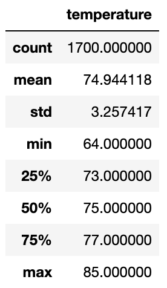
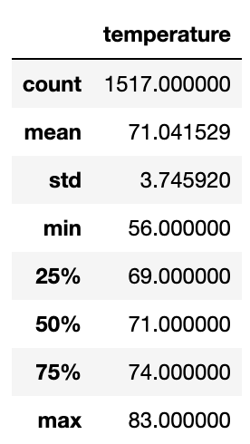

# Surfs Up

## Overview
The purpose of this analysis was to provide weather analysis to an investor looking to invest in my surf and ice cream shop. For this challenge specifically, the investor, W. Avy, wanted temperature data from the months of June and December to determnine whether or not the shop will be sustainable year round. I retrieved all temperatures for the months of June and December and then produced summary statistics for this data, telling us about the minimum and maximum temperatures as well as the average temperature for each of these months.

## Results
- The first main takeway from this analysis is that temperatures did change between the months of June and December. As seen in the images below, June's average temperature was around 75 degrees while December's average temperature was closer to 71 degrees. (June on the left, December on the right)
- It is important to recognize, however, that this change is not very signifcant. Even max temperatures only differed by 1 degree between the two months with June's high being 84 and December's being 83.
- The only notable difference lies in the standard deviations. December's standard deviation was around 3.75 while June's was only around 3.26. This means temperatures do vary quite a bit more than in June during the month of December. This can also be seen when we look at the fact that June's low was 64 degrees while December's low was only 56. 

 

## Summary 
Based on this info, it is safe to say that this surf and ice cream shop will most likely be sustainable year round. While business may decrease slightly during the winter months due to the presence of some colder days, the fact that average temperatures and max temperatures barely differ between June and December means that temperature changes shouldn't have a major impact on business. However, collecting more data is never a bad idea. It would undoubtly be a good idea to compare rainfall during these two months. Secondly a query should also be run investigating wind and even wave quality differences between these two months before any decisions are made about opening up shop. 
